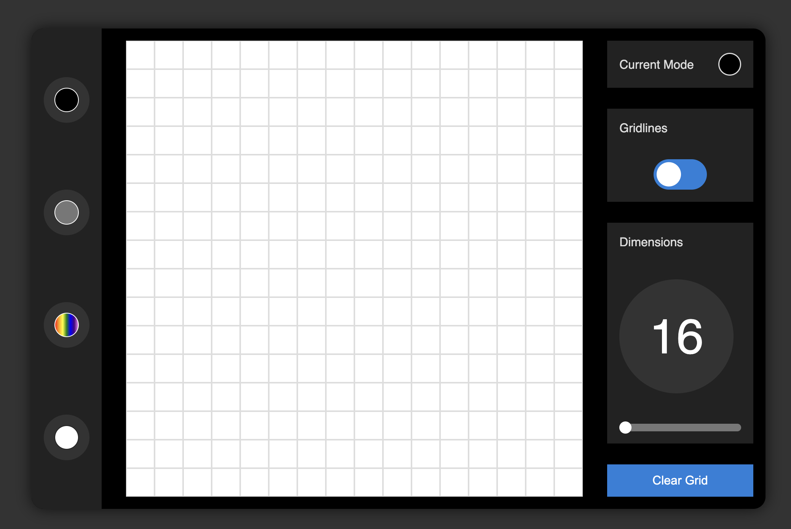

# CyberCanvas Studio

CyberCanvas Studio is a web-based drawing application inspired by the classic Etch-a-Sketch toy. This project was developed as an assignment for The Odin Project curriculum.

## Features

- **Drawing Tools**: Choose from different drawing modes including black, grayscale, rainbow, and eraser.
- **Grid Control**: Adjust the number of columns and rows in the drawing grid to your preference.
- **Toggle Gridlines**: Enable or disable visibility of the gridlines for more precise drawing.
- **Clear Grid**: Quickly clear the drawing canvas to start over.

## Usage

1. Visit the CyberCanvas Studio website.
2. Select a drawing mode from the available options.
3. Adjust the grid size if needed.
4. Start drawing on the canvas.
5. Toggle gridlines on or off as desired.
6. Use the clear grid button to reset the canvas.

## Technologies Used

- HTML
- CSS
- JavaScript
- Google Fonts
- Font Awesome Icons

## Credits

- **Developer**: [jasoneczek](https://github.com/jasoneczek)

## Preview

